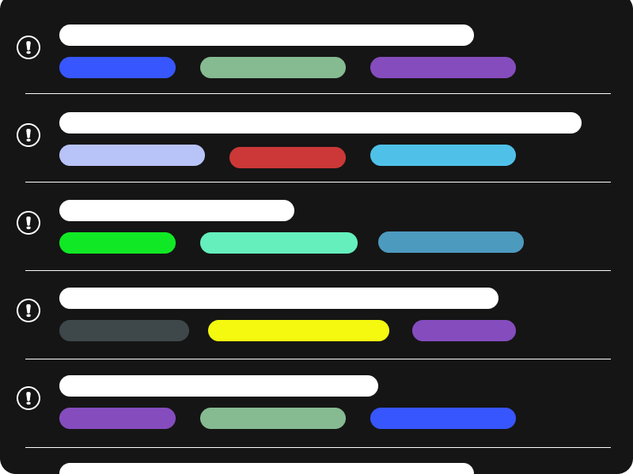

Every person who is searching for a job must track their progress in some way. I have heard of this done through spreadsheets, notepads, custom apps, etc. I tried to track them through a few different ways but each way had its issues. On a whim, I decided to try using GitHub for this round of searching for a new job. Along the way, I found a few hidden benefits.

## Huge benefit - follow up tracking 🤖

I will get to the other benefits later in this post, I just wanted to hit the big one near the beginning. GitHub offers the `Stale-bot` for free for any repository.  Stale bot adds a label to an issue if it has not been updated after a period. If the issue is still not updated after that Stale bot eventually closes the issue. This is perfect for a follow-up reminder. I used the following stalebot.yml to get a reminder every 7 days for each position.

```yaml
# Number of days of inactivity before an issue becomes stale
daysUntilStale: 7
# Number of days of inactivity before a stale issue is closed
daysUntilClose: 30
# Issues with these labels will never be considered stale
exemptLabels:
  - pinned
  - No follow up needed
  - Unsure How to follow up
# Label to use when marking an issue as stale
staleLabel: Time for follow up
# Comment to post when marking an issue as stale. Set to `false` to disable
markComment: >
  It has been 7 days since the last activity on this application. Time to follow up
# Comment to post when closing a stale issue. Set to `false` to disable
closeComment: false
```

## Keep the job description 🗄

You can copy the full job description into your issue. It is often handy to have the job description at easy access when applying for the position, updating your resume, or performing follow-up. I don't what to log into each job board to find out if the position had any follow up information in the posting. I want all the information easy to access.

## Your notes 🖉

You have unlimited (afaik) space to write your notes on a given issue. You can put all your follow up emails, voicemails, and/or names of people you talked within an issue. I use many comments on an issue to hold all my follow up actions. I can look at my entire interaction history with a position on a single page.

## GitHub Search 🔎

At the time I am writing this, I have applied to a large number of jobs. It can sometimes get confusing if you use multiple job boards. Enter the GitHub search. GitHub search lets you look for any word in the job description or notes. This is beneficial if you are not sure if you have applied to the position or company before. When I started to use GitHub issues, I was concerned about recruiters sending my resume to a job to which I already applied.

## Labels 🏷

I use labels to mark where I found the posting, how I applied, and if I have been interviewed. You can customize the labels color text and even emoji to suit your styles. Oh, and by the way, you can filter by labels as well. That is a trick I use on a near-daily basis. I sort by jobs buy if they have the `time for follow up` label and then by least recently updated (do the oldest first).

To sum up, let the bots do the tracking for you.
